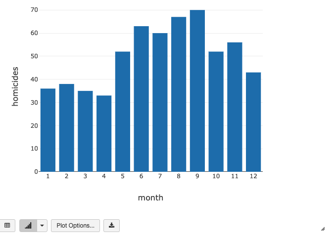

# Spark SQL Practice
This project was for class practice from [Databricks SQL Analyst](https://academy.databricks.com/sql-analyst).
## Practice1
### Overview
In this project, we finished the following tasks using Spark SQL:
- Preview data.
- Join tables and create temporary views.
- Visualize data.

### Resources
All data were provided by the class. There were three CSVs that contained Boston, Chicago, and New York crime data separately. Three tables were uploaded to the database.

### Summary
We cleaned and combined three cities' homicide data and grouped them by month. The bar chart was as follows:

- The greatest number of homicides occurred in September, and there were 70 cases in total.
- Month of April had the lowest homicide cases.

## Practice2
### Overview
In this project, we finished the following tasks:
- Create tables using different data sources and other optional parameters.
- Create and modify tables and views.
- Use built-in functions and features of Spark SQL to manage and manipulate nested objects.
- Use pivot, roll-up, cube, and window functions to aggregate data.
- Create a dashboard with data visualization.

### Resources
All data were provided by the class. This example used mock data from 4 different data centers, each with four different kinds of sensors that periodically collected temperature and CO2 level readings.

### Summary